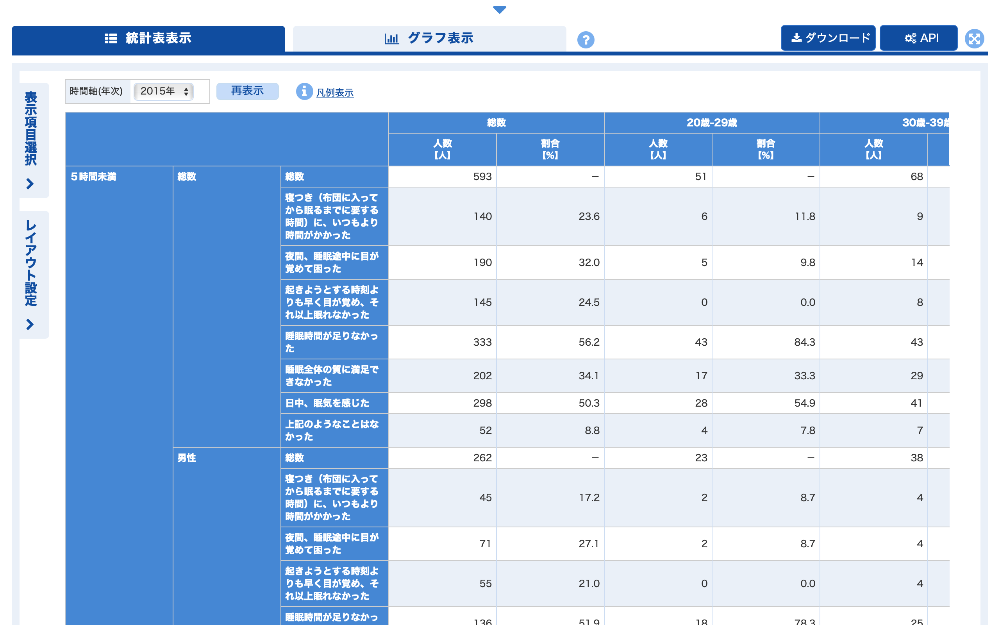
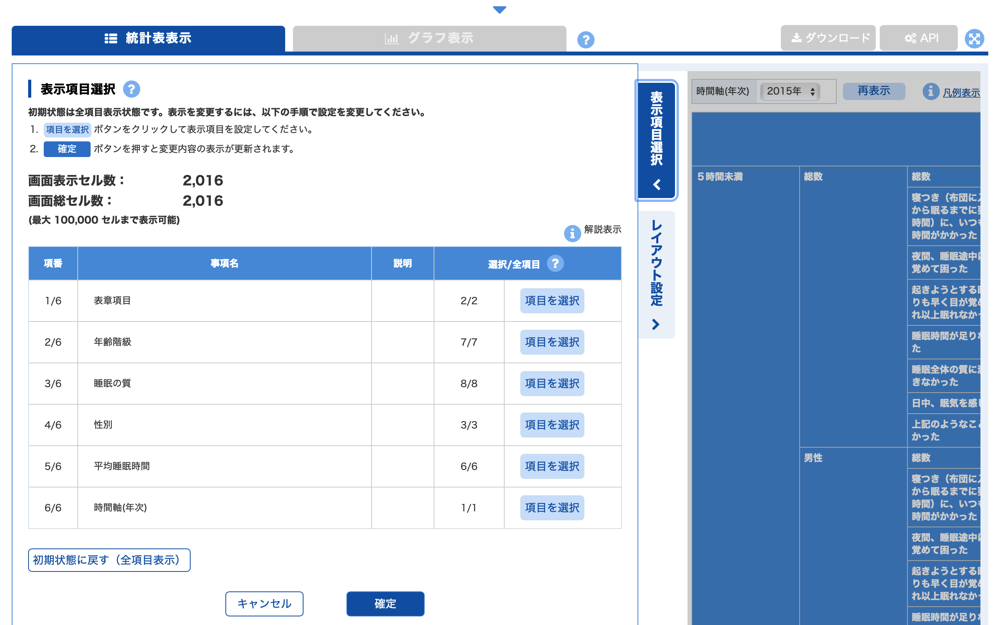
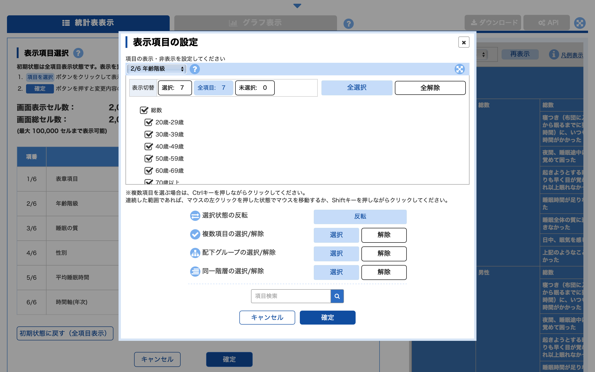

Note: This article is translated from [my Japanese article](https://uchidamizuki.quarto.pub/blog/posts/2022/12/call-e-stat-api-in-r.html).

## About this article

This article is Day 12 of the "[**R Advent Calendar 2022**](https://qiita.com/advent-calendar/2022/rlang)".

Last year marked 150 years since the establishment of government statistics in Japan ([Chronology of statistics in the Heisei and Reiwa eras](https://www.stat.go.jp/museum/toukei150/img/nenpyo/pdf/nenpyo_heisei_reiwa.pdf)). More recently, it has become possible to browse and download a wide variety of government statistical data through the [Portal Site of Official Statistics of Japan (e-Stat)](https://www.e-stat.go.jp).

e-Stat also provides a convenient [API](https://www.e-stat.go.jp/api/) (see the usage guide [here](https://www.e-stat.go.jp/api/api-info/api-guide); please check the [terms of use](https://www.e-stat.go.jp/api/agreement/) beforehand. Before using the API, you also need to complete [user registration](https://www.e-stat.go.jp/mypage/user/preregister)).

In this article, I introduce **how to use the e-Stat API efficiently** with R's [**jpstat**](https://uchidamizuki.github.io/jpstat/) **package**.

## About e-Stat

e-Stat organizes a wide variety of government statistical databases. Here, let's take a look at the [**database on sleep duration**](https://www.e-stat.go.jp/dbview?sid=0003224282) from the results of the 2015 National Health and Nutrition Survey.

Opening the database displays a statistical table as shown below, and you can download the data from the "**Download**" button in the upper right.

{width="75%"}

Clicking the "**Select display items**" button in the upper left lets you choose which data items (age group, sex, etc.) to display.

{width="75%"}

For example, if you want to select age groups, clicking the "**Select items**" button for age group brings up a screen like the one below, where you can choose the age groups.

{width="75%"}

After selecting the display items, clicking the "**Download**" button lets you download only the data for the selected items.

In this way, e-Stat makes it easy to extract and download data. However, if you want to improve the **reproducibility of your data-retrieval work** or make **programmatic data extraction and retrieval more efficient**, using the **e-Stat API** is recommended.

## Using the e-Stat API with the jpstat package

To perform, via the e-Stat API, the same data extraction and download process described above for e-Stat, you need to follow steps like these.

1.  [**Retrieve metadata**](https://www.e-stat.go.jp/api/api-info/e-stat-manual3-0#api_2_2) and set parameters: retrieve and select the display item data, and set the [API parameters](https://www.e-stat.go.jp/api/api-info/e-stat-manual3-0#api_3_4) corresponding to the selected items
2.  [**Retrieve statistical data**](https://www.e-stat.go.jp/api/api-info/e-stat-manual3-0#api_2_3): retrieve the selected data and format it into a table

The [jpstat](https://uchidamizuki.github.io/jpstat/) package was developed to carry out this series of tasks efficiently in R[^1]. The jpstat package can be installed from CRAN.

[^1]: The e-Stat API provides a variety of other functionality besides metadata retrieval and statistical data retrieval (see the [API specification](https://www.e-stat.go.jp/api/api-info/e-stat-manual3-0)).

Here, with the goal of **plotting sleep duration by sex and age group**, let's retrieve data from the [sleep duration database](https://www.e-stat.go.jp/dbview?sid=0003224282) (2015) introduced above. First, load the required packages.

```{r}
#| label: install
#| eval: false

install.packages("jpstat")

```

```{r}
#| label: setup
#| message: false
#| warning: false

library(tidyverse)
library(jpstat)

```

### Step 1: Display and extract the metadata (display items)

To use the e-Stat API, you first need to complete [**user registration**](https://www.e-stat.go.jp/mypage/user/preregister) and **obtain an application ID called `appId`**[^2].

[^2]: To obtain an application ID, you need to register a URL. If you are not going to use it on a public site, it is recommended that you enter a local address such as `http://test.localhost/` (for details, see the [usage guide](https://www.e-stat.go.jp/api/api-info/api-guide)).

By passing the `appId` and the database URL (or the statistical table ID, `statsDataId`) to the `estat()` function, you can retrieve the metadata (display items)[^3].

[^3]: Clicking the "**API**" button in the upper right of an e-Stat page displays the corresponding API query. You can also retrieve metadata by directly entering the `statsDataId` found in that query.

First, let's look at the metadata for "age group (`cat01`)" ( `cat01` is the classification name used in the API). The `activate()` function displays the metadata, and the `filter()` function lets you select items. Here, since we only need the data broken down by age group, we remove the "total" data[^4].

[^4]: Note, however, that each parameter has an upper limit of 100 items, so if filtering would still leave a large number of items, it is recommended to select all items without filtering.

By using the pipe operator `|>`, you can continue extracting metadata for parameters other than `cat01` as shown below. Here, we extract the **number of respondents by sex, age group, and sleep duration**.

```{r}
#| label: appId
#| eval: false

# Replace this with your own appId
Sys.setenv(ESTAT_API_KEY = "Your appId")

```

```{r}
#| label: get-meta-data

estat_sleeptime_2015 <- estat(statsDataId = "https://www.e-stat.go.jp/dbview?sid=0003224282")

```

```{r}
#| label: activate-an-item

# View and select the metadata
estat_sleeptime_2015 |>
  activate(cat01) |>
  filter(name != "総数")

```

```{r}
estat_sleeptime_2015_filtered <- estat_sleeptime_2015 |>

  # Tabulation item
  activate(tab) |>
  filter(name == "人数") |>

  # Age group
  activate(cat01) |>
  filter(name != "総数") |>

  # Sleep quality
  activate(cat02) |>
  filter(name == "総数") |>

  # Sex
  activate(cat03) |>
  filter(name %in% c("男性", "女性"))
```

### Step 2: Retrieve (download) the statistical data

Applying `collect()` after extracting the data retrieves the statistical data. You can also use the `n` argument of `collect()` to name the column of retrieved data. Here, we name it `"person"`.

Looking at the retrieved data `data_sleeptime_2015`, you can see it has many columns, making it hard to work with for analysis. In **Step 2+α**, I explain how to retrieve and reshape the data at the same time.

```{r}
data_sleeptime_2015 <- estat_sleeptime_2015_filtered |>

  # Retrieve the data and convert to numeric
  collect(n = "person") |>
  mutate(person = parse_number(person))

knitr::kable(head(data_sleeptime_2015, 10))
```

### Step 2+α: Retrieve and reshape the data at the same time

When you retrieve e-Stat data with jpstat, columns (such as `cat01_code` and `cat01_name`) are created from the parameter names (such as `cat01`) combined with the column name for each item (`code`, `name`, etc.).

In jpstat, you can tidy up the data by renaming parameters with the `rekey()` function and selecting columns per item with the `select()` function[^5]. Writing the code as below produces a nicely tidied dataset.

[^5]: You can also use the `select()` function to drop all columns for a given item. This is convenient when you want to remove items that aren't needed for analysis, such as when only the "total" is selected.

```{r}
data_sleeptime_2015 <- estat_sleeptime_2015 |>
  activate(tab) |>
  filter(name == "人数") |>
  select() |>

  activate(cat01) |>
  rekey("ageclass") |>
  filter(name != "総数") |>
  select(name) |>

  activate(cat02) |>
  filter(name == "総数") |>
  select() |>

  activate(cat03) |>
  rekey("sex") |>
  filter(name %in% c("男性", "女性")) |>
  select(name) |>

  activate(cat04) |>
  rekey("sleeptime") |>
  select(name) |>

  activate(time) |>
  select() |>

  collect(n = "person") |>
  mutate(person = parse_number(person))

knitr::kable(head(data_sleeptime_2015, 10))
```

### Bonus: Plotting the retrieved data

Finally, let's plot the **2015 sleep duration data by sex and age group** that we retrieved. The plot shows that the pattern of sleep duration by age group differs between men and women.

```{r}
#| fig-width: 8
#| fig-height: 5

data_sleeptime_2015 |>
  mutate(ageclass_name = as_factor(ageclass_name),
         sex_name = as_factor(sex_name),
         sleeptime_name = as_factor(sleeptime_name)) |>
  group_by(ageclass_name, sex_name) |>
  mutate(prop = person / sum(person)) |>
  ungroup() |>
  ggplot(aes(ageclass_name, prop,
             fill = fct_rev(sleeptime_name))) +
  geom_col() +
  geom_text(aes(label = if_else(prop > 0.05,
                                scales::label_percent(accuracy = 1)(prop),
                                "")),
            position = position_stack(vjust = 0.5)) +
  scale_x_discrete("Age group") +
  scale_y_continuous("Proportion",
                     labels = scales::label_percent(accuracy = 1)) +
  scale_fill_brewer("Sleep duration",
                    palette = "Spectral") +
  facet_wrap(~ sex_name) +
  guides(x = guide_axis(n.dodge = 2))
```

## Summary

In this article, I introduced how to efficiently retrieve Japanese statistical data using the e-Stat API and the [jpstat](https://uchidamizuki.github.io/jpstat/) package.

Retrieving statistical data in R improves the reproducibility and efficiency of your work. The jpstat package is also convenient because it lets you retrieve and reshape data at the same time. I encourage you to give it a try.
