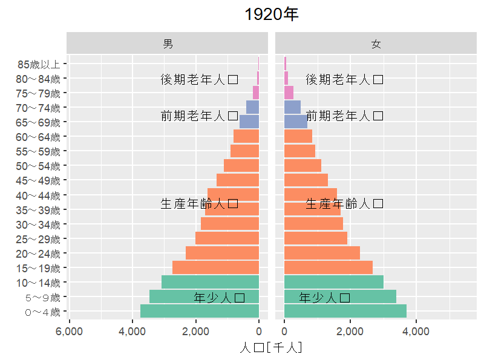

Note: This article is translated from [my Japanese article](https://uchidamizuki.quarto.pub/blog/posts/2023/01/create-an-animation-of-a-population-pyramid-in-r.html).

## About this article

Referring to the [population pyramid transition animation](https://www.ipss.go.jp/site-ad/TopPageData/Pyramid_a.html) published by the National Institute of Population and Social Security Research (IPSS), I tried creating an animation like the one below using ggplot2 in R.



## Getting time-series data from the Population Census

First, let's get the [time-series data on population by sex and 5-year age group from the Population Census](https://www.e-stat.go.jp/dbview?sid=0003410380), published on e-Stat, using R's jpstat package.

To use the e-Stat API from the jpstat package, you need to obtain an application ID (`appId`).

```{r}
#| label: load-packages
#| message: false
#| warning: false

library(tidyverse)
library(jpstat)

```

```{r}
#| label: set-appId
#| eval: false

# Replace this with your own appId
Sys.setenv(ESTAT_API_KEY = "Your appId")

```

```{r}
#| label: get-data

census <- estat(statsDataId = "https://www.e-stat.go.jp/dbview?sid=0003410380")

pop <- census |>
  activate(tab) |>
  filter(name == "人口") |>
  select() |>

  # Extract sex
  activate(cat01) |>
  rekey("sex") |>
  filter(name %in% c("男", "女")) |>
  select(name) |>

  # Extract age class
  activate(cat02) |>
  rekey("ageclass") |>
  filter(str_detect(name, "^\\d+～\\d+歳$") |
           name == "85歳以上" |
           name == "110歳以上") |>
  select(name) |>

  # Extract year
  activate(time) |>
  rekey("year") |>
  filter(str_detect(name, "^\\d+年$")) |>
  select(name) |>

  # Get e-Stat data
  collect(n = "pop") |>

  rename_with(~ .x |>
                str_remove("_name$")) |>
  mutate(sex = as_factor(sex),
         year = parse_number(year),

         # Get the minimum age for each age class
         age_from = ageclass |>
           str_extract("^\\d+") |>
           stringi::stri_trans_nfkc() |>
           as.integer(),

         # Treat "85歳以上" as the highest age class
         ageclass = case_when(age_from >= 85 ~ "85歳以上",
                              TRUE ~ ageclass) |>
           as_factor(),

         # Add age group
         agegroup = case_when(between(age_from, 0, 10) ~ "Youth population",
                              between(age_from, 15, 60) ~ "Working-age population",
                              between(age_from, 65, 70) ~ "Young-old population",
                              age_from >= 75 ~ "Old-old population") |>
           as_factor(),
         pop = parse_number(pop)) |>

  # Aggregate the "85歳以上" population
  group_by(year, sex, ageclass, agegroup) |>
  summarise(pop = sum(pop),
            .groups = "drop")

knitr::kable(head(pop))
```

## Creating the population pyramid animation

By using R's gganimate package, you can turn a ggplot2 graph into an animation.

```{r}
#| label: create-gif

library(gganimate)

# Data for displaying age groups
agegroup <- pop |>
  group_by(sex, agegroup) |>
  summarise(ageclass = mean(as.integer(ageclass)),
            .groups = "drop") |>
  mutate(hjust = case_when(sex == "男" ~ 1.25,
                           sex == "女" ~ -0.25))

poppyramid <- pop |>

  # Convert male population to negative values to create the population pyramid
  mutate(pop = if_else(sex == "男", -pop, pop)) |>

  ggplot(aes(ageclass, pop,
             group = sex,
             fill = agegroup)) +
  geom_col(show.legend = FALSE) +
  geom_text(data = agegroup,
            aes(label = agegroup,
                hjust = hjust),
            y = 0) +
  scale_x_discrete(NULL) +
  scale_y_continuous("Population [thousands]",

                     # Convert labels to absolute values in thousands
                     labels = purrr::compose(scales::label_comma(scale = 1e-3), abs)) +
  scale_fill_brewer(palette = "Set2") +
  coord_flip() +
  facet_wrap(~ sex,
             scales = "free_x") +
  labs(title = "Year {frame_time %/% 5 * 5}") +
  theme(plot.title = element_text(hjust = 0.5)) +

  # Convert to animation
  transition_time(year)

# Change width and height
animate(poppyramid,
        width = 800,
        height = 600,
        units = "px",
        res = 150,
        renderer = gifski_renderer())
```

```{r}
#| label: save-gif
#| echo: false

anim_save("poppyramid.gif")
```
