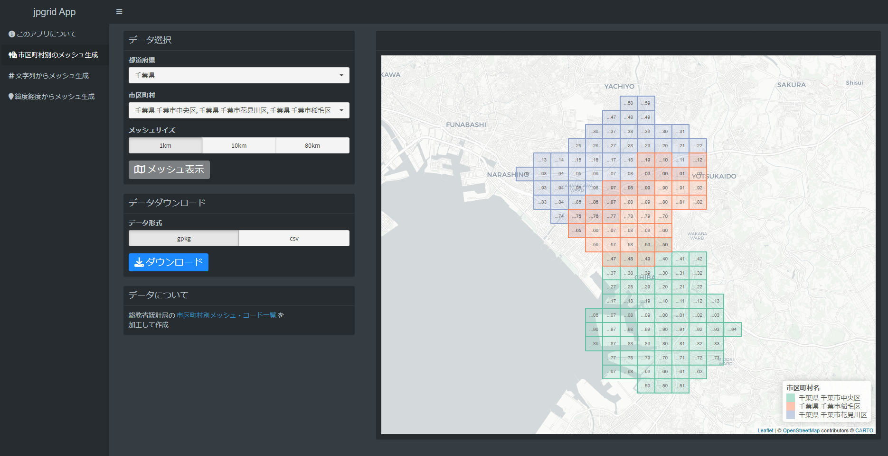
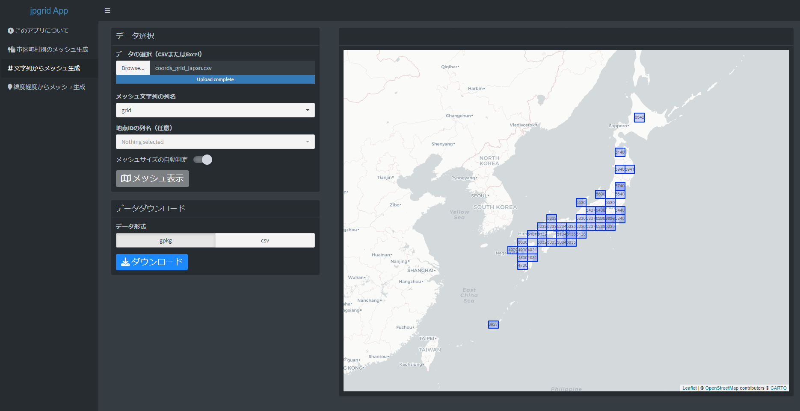
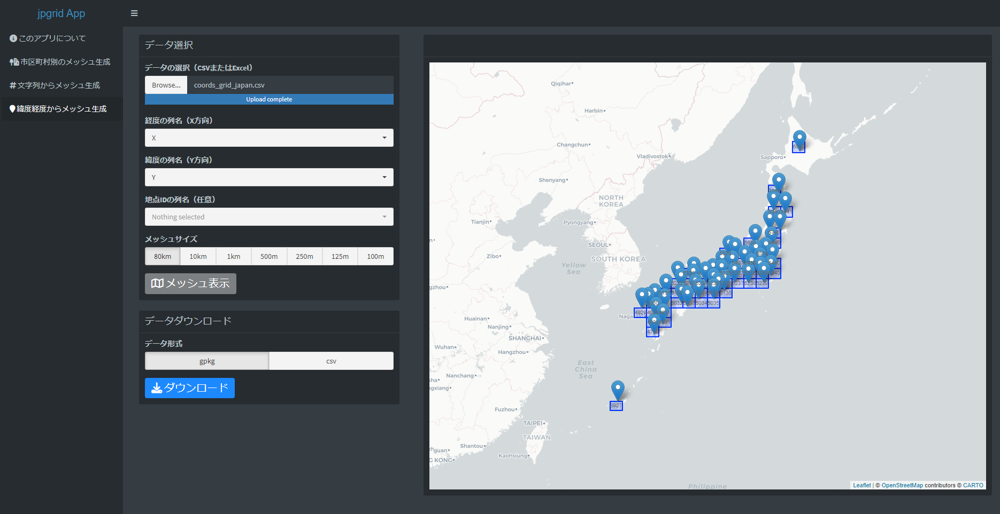

Note: This article is translated from [my Japanese article](https://uchidamizuki.quarto.pub/blog/posts/2023/02/web-app-for-grid-square-codes-in-japan.html).

## About this app

I built a [web app for working with Japanese grid square (mesh) data](https://uchidamizuki.shinyapps.io/jpgrid-app/) using [R Shiny](https://shiny.rstudio.com).

A [grid square](https://www.stat.go.jp/data/mesh/m_tuite.html) is a division of (Japanese) regions into roughly square cells based on longitude and latitude, and it is commonly used as an aggregation unit for statistical data.

The app I built provides some of the functionality of the R package [jpgrid](https://uchidamizuki.github.io/jpgrid/). The app offers the following features:

1.  Generate grid square data by municipality
2.  Generate grid square data from tabular data containing grid code strings
3.  Generate grid square data from tabular data containing longitude/latitude

[](https://uchidamizuki.shinyapps.io/jpgrid-app/)

## App features

### Generate grid square data by municipality

It retrieves grid squares by municipality from the [List of grid square codes by municipality](https://www.stat.go.jp/data/mesh/m_itiran.html) published by the Statistics Bureau of Japan.

You can generate and save grid squares by municipality using the following steps:

1.  Select prefecture(s) (multiple selection allowed)
2.  Select municipality(ies) (multiple selection allowed)
3.  Select a grid size (1 km, 10 km, or 80 km) and click "Show grid"
4.  Select a data format (GeoPackage or CSV) and click "Download"



The jpgrid package provides grid square data by municipality via the `grid_city_2020` dataset.

You can visualize grid square data by municipality as follows.

```{r}
#| message: false
#| warning: false

library(jpgrid)
library(tidyverse)

JGD2011 <- 6668

grid_city_2020 |>
  filter(city_name_ja %in% c("千葉市中央区", "千葉市花見川区", "千葉市稲毛区")) |>
  grid_as_sf(crs = 6668) |> 
  ggplot(aes(fill = city_name_ja)) +
  geom_sf() +
  scale_fill_brewer(palette = "Set2")
```

### Generate grid square data from tabular data containing grid code strings

You can generate and save grid squares from tabular data containing grid code strings using the following steps:

1.  Select data (CSV or Excel)
2.  Specify the column name containing the grid code strings (a point ID can also be specified) and click "Show grid"
3.  Select a data format (GeoPackage or CSV) and click "Download"

In the jpgrid package, `parse_grid()` can be used to generate grid squares from strings.

```{r}
#| warning: false
#| echo: false

coords_grid_japan <- rnaturalearth::ne_states("japan",
                                              returnclass = "sf") |> 
  sf::st_centroid() |> 
  sf::st_coordinates() |> 
  as_tibble() |> 
  mutate(grid = coords_to_grid(X, Y, "80km") |> 
           as.character())

fs::dir_create("data")
write_csv(coords_grid_japan, "data/coords_grid_japan.csv")
```



### Generate grid square data from tabular data containing longitude/latitude

Similarly, you can generate and save grid squares from tabular data containing longitude/latitude using the following steps:

1.  Select data (CSV or Excel)
2.  Specify the column names for longitude (X) and latitude (Y) (a point ID can also be specified) and click "Show grid"
3.  Select a data format (GeoPackage or CSV) and click "Download"

In the jpgrid package, `coords_to_grid()` can be used to generate grid squares from strings.



## Conclusion

I introduced a web app for grid square data built with R Shiny.

The jpgrid package used to build this app provides many other features not included in the app. For details, please see [here](https://uchidamizuki.github.io/jpgrid/).

For example, there is `geometry_to_grid()`, which converts geometries into grid squares.

I encourage you to try using the jpgrid package for your grid square data analysis as well.

```{r}
#| dev: ragg_png

japan <- rnaturalearth::ne_countries(country = "japan",
                                     scale = "medium",
                                     returnclass = "sf")
grid_japan <- japan |> 
  geometry_to_grid("80km") |> 
  dplyr::first() |> 
  grid_as_sf(crs = sf::st_crs(japan))

japan |> 
  ggplot() +
  geom_sf() +
  geom_sf(data = grid_japan,
          fill = "transparent")
```
