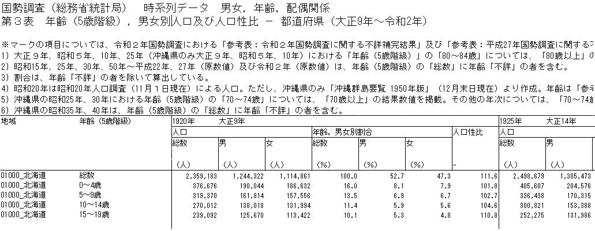
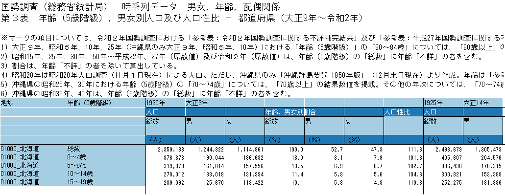

Note: This article is translated from [my Japanese article](https://uchidamizuki.quarto.pub/blog/posts/2024/12/tips-for-tidying-excel-file-with-r.html).

This article is the 23rd-day entry for [R Advent Calendar 2024](https://qiita.com/advent-calendar/2024/rlang).

In data analysis, data preprocessing is unavoidable. Recently, creating machine-readable data has become increasingly important, but arranging data into a format that is easy to read for both humans and machines is not easy.

So, in this article, I introduce some tips for tidying Excel files with R—files that are often created with human readers in mind. This article mainly focuses on tips for Excel files, but I think they can also be applied to other data formats such as CSV files.

There are mainly two approaches to tidying Excel files. In this article, I will first explain how to interpret the table structure of an Excel file, and then introduce data-tidying methods using the following approaches.

1.  Using the [readxl](https://readxl.tidyverse.org) package
2.  Using the [tidyxl](https://nacnudus.github.io/tidyxl/) and [unpivotr](https://nacnudus.github.io/unpivotr/) packages

Also, since several articles on tidying Excel file data have already been published in Japanese, the following articles may also be helpful.

-   [Tidying a "god-tier" Excel file with R (in Japanese)](https://bunseki-data.com/r-onlinecourse/2023/11/09/%E7%A5%9Eexcel%E3%82%92r%E3%81%A7tidy%E5%8C%96%E3%81%97%E3%81%A6%E3%81%BF%E3%82%88%E3%81%86/)
-   [Defense techniques against "dark" Excel files (in Japanese)](https://y-mattu.hatenablog.com/entry/read_dark-excel)

## Before tidying an Excel file

Before getting into the main topic, there's one thing I'd like to note: check whether the data you want to use for analysis is available in a more machine-readable format.

Excel files are convenient for viewing data, but they are often not very machine-readable. Therefore, it's advisable to check in advance whether the data is available in a more suitable format. For example, e-Stat, Japan's portal site for government statistics, sometimes lets you use its API to obtain data that is more machine-readable than a typical Excel file.

## The "gap between humans and machines" in data formats

Data that is easy for us to read isn't necessarily easy for a machine to read. A classic example of this is weekly weather forecast data[^1].

[^1]: This example is also used on the [Tidy data](https://ja.wikipedia.org/wiki/Tidy_data) page of the Japanese Wikipedia.

For example, let's say we have the following dummy weekly weather forecast data. If a human looks at this data, they can immediately understand that it's "weather by region and date." However, it may be surprisingly difficult for a machine to mechanically grasp the following:

-   That the column names from the second column onward represent dates
-   That the values in the columns from the second column onward represent weather

```{r}
#| label: weather-forecast
#| message: false
#| warning: false
#| code-fold: true

library(tidyverse)

region <- c("Sapporo", "Tokyo", "Nagoya", "Osaka", "Fukuoka", "Naha")
date <- seq(ymd("2024-12-20"), ymd("2024-12-26"), by = "day") |>
  format("%m/%d")
weather <- c("🌞", "⛅", "☔")

set.seed(1234)
weather_forecast <- expand_grid(region = region, date = date) |>
  mutate(weather = sample(weather, n(), replace = TRUE))

weather_forecast_wider <- weather_forecast |>
  pivot_wider(names_from = date, values_from = weather)
weather_forecast_wider

```

To make it clearer that the data above represents "weather by region and date," data like the following is more suitable. In this data, the observed value—weather—is properly mapped to the axes (dimensions) of region and date, and this kind of long-format data is called tidy data. However, if data in this long format were shown on the news, most people would probably find it hard to read[^2].

[^2]: You'd need a portrait-oriented TV to check a weekly weather forecast like this!

```{r}
#| label: weather-forecast-tidy

weather_forecast

```

Why does this "gap between humans and machines" arise?

The figure below shows the long-format data above plotted as a scatter plot with ggplot2. Comparing this scatter plot with the table shown earlier, you can see that they look quite similar. For us, a table with axes in both the vertical and horizontal directions may be more intuitive to understand than one with only a vertical axis.

```{r}
#| label: weather-forecast-plot
#| dev: ragg_png
#| fig-width: 5
#| fig-height: 3
#| fig-dpi: 800

weather_forecast |>
  ggplot(aes(date, region, label = weather)) +
  geom_text() +
  scale_x_discrete(position = "top") +
  scale_y_discrete(limits = rev)

```

## Interpreting the table structure of an Excel file

With this "gap between humans and machines" in mind, let's interpret the table structure of an actual Excel file.

With this "gap between humans and machines" in mind, let's interpret the table structure of an actual Excel file. If the data is as simple as "weather by region and date," the table structure isn't too complex. But what about data such as "population by year, region, sex, and age group," for example? Let's actually look at [this Excel file](https://www.e-stat.go.jp/stat-search/files?page=1&layout=datalist&toukei=00200521&tstat=000001011777&cycle=0&tclass1=000001011778&stat_infid=000001085927&tclass2val=0) published on e-Stat. The image below shows an excerpt of the top part of the Excel file.



Leaving aside the explanatory text at the top of the data, we can see it has the following data format. If we color-code the axes (dimensions)—year, region, sex, and age—in light blue ([■]{style="color:#a6cee3;"}), and the type/unit of the observed values—population, population ratio, and sex ratio—in blue ([■]{style="color:#1f78b4;"}), we get the figure shown below. To summarize the details of the data format:

-   Columns 1 and 2 store the axis (dimension) information for region and age group, respectively
-   The part corresponding to the column names from column 3 onward mixes axis (dimension) information with observed-value information
    -   Rows 1 and 3 store the axis (dimension) information for year and sex, respectively
    -   Rows 2 and 4 record the type and unit of the observed values—population, population ratio, and sex ratio, respectively



When tidying an Excel file, it's important to keep the following points in mind:

-   When column names span multiple rows, you need to sort out in advance whether the information in each row corresponds to an axis (dimension) or to an observed value
-   To avoid duplicate column names, some column names are often abbreviated, or cells are merged

## Tidying an Excel file with readxl

Now, let's actually tidy an Excel file. Below, I show the code for tidying the "population by year, region, sex, and age" Excel file introduced above.

The [readxl](https://readxl.tidyverse.org) package is useful for reading Excel files[^3]. Here, since we'll use the readxl package to tidy the Excel file, let's load the readxl and tidyverse packages in advance.

[^3]: The [writexl](https://docs.ropensci.org/writexl/) package is also useful.

```{r}
#| label: setup
#| message: false
#| warning: false

# Install packages as needed
# install.packages("pak")
# pak::pak("readxl")
# pak::pak("tidyverse")

library(readxl)
library(tidyverse)

```

```{r}
#| label: download-data
#| eval: false
#| code-fold: true
#| code-summary: Code used to download the data

library(fs)

exdir <- "tips-tidying-excel-data-with-r"
dir_create(exdir)

destfile <- path(exdir, "population_by_year_sex_age_class", ext = "xlsx")
if (!file_exists(destfile)) {
  curl::curl_download(
    "https://www.e-stat.go.jp/stat-search/file-download?statInfId=000001085927&fileKind=0",
    destfile = destfile
  )
}

```

### 1. Reading column names and handling merged cells

As the first step in reading the Excel file, let's start by getting the column names. Normally, for tabular data such as CSV files, the column names are recorded in the first row.

However, in the Excel file shown above, the column names are recorded across multiple rows starting from the third column, so some work is needed to properly set them as the column names of the data frame.

So, let's first read the column names using the `read_excel()` function from the readxl package. Although there are some differences, such as how the `col_types` argument is specified, `read_excel()` can basically read Excel files in a format similar to readr's `read_csv()` function[^4].

[^4]: By using [cellranger](https://readxl.tidyverse.org/reference/cell-specification.html), you can also specify cell ranges in detail.

Since the column names from the third column onward store axis (dimension) and observed-value information horizontally, we transpose them with the `t()` function before converting to a data frame. Furthermore, if we exclude the first two rows (region and age group), we get the following data.

```{r}
#| label: read-col-names

# Location of the Excel file downloaded in advance
file <- "tips-tidying-excel-file-with-r/population_by_year_sex_age_class.xlsx"
sheet <- "da03"

data_col_names <- read_excel(
  file,
  sheet = sheet, # Sheet name
  skip = 10, # Skip the explanatory section
  n_max = 5, # Only read the column-name section
  col_names = FALSE,
  col_types = "text",
  .name_repair = "minimal"
) |>
  # Transpose, then convert to a data frame
  t() |>
  as_tibble(
    .name_repair = ~ c("year", "value_type", "sex", "", "value_unit")
  ) |>
  select(year, value_type, sex, value_unit) |>

  # Exclude the first two rows (region and age group)
  slice_tail(n = -2)

head(data_col_names, n = 10)

```

Looking at `data_col_names`, we can see the following:

-   The `year` column contains a mix of Gregorian and Japanese-era years
-   In the `year` and `value_type` columns, some column names are omitted and become `NA` to avoid duplicate column names

So, the code below mainly performs the following processing:

-   Extract only the Gregorian year number from the `year` column
-   Use tidyr's `fill()` function to fill in the `NA` values in the `year` and `value_type` columns

With this, we're now ready to create the column names.

```{r}
#| label: process-col-names

data_col_names <- data_col_names |>
  # Extract only the Gregorian year number
  mutate(
    year = year |>
      str_extract("^\\d+(?=年$)") |>
      as.integer(),

    # Replace with an empty string if value_unit is "-"
    value_unit = if_else(value_unit == "-", "", value_unit)
  ) |>

  # Fill in NA values in year and value_type
  fill(year, value_type)

head(data_col_names, n = 10)

```

### 2. Creating column names and reading the data

Now, let's create the column names using `data_col_names`. Here, the column names were created using the following steps:

-   First, combine the `value_type` and `value_unit` columns to create the `value_type` column
-   Next, combine the `year`, `sex`, and `value_type` columns in that order, separated by `"/"`, to create the `col_name` column
-   Finally, combine the data from `"region"`, `"age_class"`, and the `col_name` column to create the column names

The code below uses tidyr's `unite()` function to combine the data frame's column names. With this, the column names needed for reading the data have been created.

```{r}
#| label: make-col-names

col_names <- data_col_names |>
  unite("value_type", value_type, value_unit, sep = "") |>
  unite("col_name", year, sex, value_type, sep = "/") |>
  pull(col_name)
col_names <- c("region", "age_class", col_names)

head(col_names, n = 10)

```

Let's use `col_names` to read the data. By specifying `col_names = col_names` in the `read_excel()` function, we can read the data using the column names we just created.

```{r}
#| label: read-data

data <- read_excel(
  file,
  sheet = sheet,
  skip = 10 + 5,
  col_names = col_names,
  col_types = "text",
  .name_repair = "minimal"
) |>

  # Remove duplicate columns found at the end (likely a mistake made when the original data was created)
  select(all_of(vctrs::vec_unique_loc(col_names)))

head(data, n = 10)

```

### 3. Converting to tidy data

Finally, let's tidy the data and convert it into tidy data. Since tidy data is usually in long format, tidyr's `pivot_longer()` function is useful. With `pivot_longer()`, the `names_sep` argument lets us expand multiple pieces of information contained in the column names into separate columns.

In this Excel file, the year and sex information—besides the axes (dimensions) of region and age group—are included in the column names, so we expand them using the `names_sep = "/"` argument. Furthermore, since year and sex are stored in the 1st and 2nd positions, respectively, of the parts separated by `"/"`, we specify `"year"` and `"sex"` for the 1st and 2nd positions of the `names_to` argument.

Furthermore, the 3rd position of the parts separated by `"/"`—`人口（人）` (population count), `年齢，男女別割合（％）` (percentage by age and sex), and `人口性比` (sex ratio)—correspond to observed values, and in this case, we want to keep them as column names rather than expanding them into columns. This can be achieved by specifying `".value"` for the 3rd position of the `names_to` argument of `pivot_longer()`.

Therefore, the code below converts the data into long-format data.

```{r}
#| label: tidy-data

data <- data |>
  pivot_longer(
    !c(region, age_class),
    names_to = c("year", "sex", ".value"),
    names_sep = "/",
    names_transform = list(
      sex = \(x)
        x |>
          na_if("NA")
    )
  ) |>
  # Convert the population, percentage-by-age-and-sex, and sex-ratio columns to numeric
  mutate(across(c(`人口（人）`, `年齢，男女別割合（％）`, 人口性比), \(x) {
    parse_number(x, na = "-")
  })) |>
  relocate(year, region, sex, age_class)

head(data, n = 10)

```

Looking at `data`, we can see that the `sex` column is always `NA` for `人口性比` (sex ratio). So, in the code below, we split `data` into `data_population`, which contains `人口（人）` (population count) and `年齢，男女別割合（％）` (percentage by age and sex), and `data_sex_ratio`, which contains `人口性比` (sex ratio). Doing this makes the meaning of each dataset clearer.

```{r}
#| label: tidy-data-population-sex-ratio

data_population <- data |>
  drop_na(sex) |>
  select(!人口性比)

head(data_population, n = 5)

data_sex_ratio <- data |>
  filter(is.na(sex)) |>
  select(!c(sex, `人口（人）`, `年齢，男女別割合（％）`))

head(data_sex_ratio, n = 5)

```

## Tidying an Excel file with tidyxl and unpivotr

Next, I'll introduce how to tidy an Excel file using the [tidyxl](https://nacnudus.github.io/tidyxl/) and [unpivotr](https://nacnudus.github.io/unpivotr/) packages.

With the readxl package, we needed to go through many steps: creating column names, reading the data, and converting it to tidy data. With the tidyxl and unpivotr packages, by using long-format data that expands the Excel file's table into "values by row and column," we can tidy data more flexibly and efficiently than with readxl.

First, let's load the packages we'll need.

```{r}
#| label: setup-tidyxl-unpivotr
#| message: false
#| warning: false

# Install packages as needed
# install.packages("pak")
# pak::pak("tidyxl")
# pak::pak("unpivotr")
# pak::pak("tidyverse")

library(tidyxl)
library(unpivotr)
library(tidyverse)

```

### 1. Reading the Excel file

Let's read the Excel file using the `xlsx_cells()` function from the tidyxl package. This function lets us retrieve the Excel file's cell information by row and column.

```{r}
#| label: read-excel-tidyxl

cells <- xlsx_cells(file, sheets = sheet)

head(cells, n = 10)

```

By applying unpivotr's `behead()` function to the `cells` we read, we can add axis (dimension) information to the data. Specifically, we add this information by specifying the direction `direction` in which the axis (dimension) information lies relative to the data. In particular, specifying something like `direction = "up-left"` lets us handle blank cells and merged cells, which is very convenient.

To use the `behead()` function, you need to have already worked out the table structure beforehand. For details on how to specify the `direction` relative to the data, the following is a helpful reference:

-   [Directions from data cells to headers](https://nacnudus.github.io/unpivotr/reference/direction.html)

In the code below, based on the table structure we worked out above, we create `data2`, which has the same information as the `data` we created with readxl. You can see that we're able to read the data with less code than when using readxl.

```{r}
#| label: make-data-tidyxl

data2 <- cells |>
  # Exclude the first 10 rows, which are the explanatory section
  filter(row > 10) |>

  # Column 1 represents region (on the left side, as seen from the data)
  behead("left", "region") |>

  # Column 2 represents age group (on the left side, as seen from the data)
  behead("left", "age_class") |>

  # Row 1 represents the calendar year (up-left side, as seen from the data)
  filter(row != 10 + 1 | str_detect(character, "^\\d+年$")) |> # Remove Japanese-era years
  behead("up-left", "year") |>

  # Row 2 represents the value type (up-left side, as seen from the data)
  behead("up-left", "value_type") |>

  # Row 3 represents sex (up side, as seen from the data)
  behead("up", "sex") |>

  # Row 5 represents the unit (up side, as seen from the data)
  behead("up", ".") |> # Assign a placeholder name to the blank row 4 (to be removed later)
  behead("up", "value_unit") |>

  select(year, region, age_class, sex, value_type, value_unit, numeric)

head(data2, n = 5)

```

### 2. Converting to tidy data

The `data2` we just created is long-format data, but the value type `value_type` (population, percentage by age and sex, or sex ratio) is still expanded across columns, so it's not necessarily in a format well-suited for data analysis.

So, let's use tidyr's `pivot_wider()` function to expand the value type `value_type` into rows. In the code below, we combine the `value_type` and `value_unit` columns before converting to wide-format data. This gives us data that is nearly equivalent to the `data` we created using readxl.

To avoid repetition, I'll skip the details, but as with readxl, if we split the data into one containing `人口（人）` (population count) and `年齢，男女別割合（％）` (percentage by age and sex), and one containing sex ratio, the data tidying is complete.

```{r}
#| label: tidy-data-tidyxl

data2 <- data2 |>
  # Create the value_type column, same as when using readxl
  mutate(value_unit = if_else(value_unit == "-", "", value_unit)) |>
  unite("value_type", value_type, value_unit, sep = "") |>

  # Remove duplicates
  slice_head(n = 1, by = c(year, region, age_class, sex, value_type)) |>

  # Expand the value type into columns to create wide-format data
  pivot_wider(names_from = value_type, values_from = numeric)

head(data2, n = 10)

```

## Summary

In this article, I introduced some tips for tidying Excel files. As approaches to data tidying, I introduced the method using the readxl package and the method using the tidyxl and unpivotr packages. In either case, interpreting the table structure of the data is important.

If you have any suggestions for improvement, additional content, or questions about the data-tidying workflow introduced in this article, I'd appreciate your comments.
